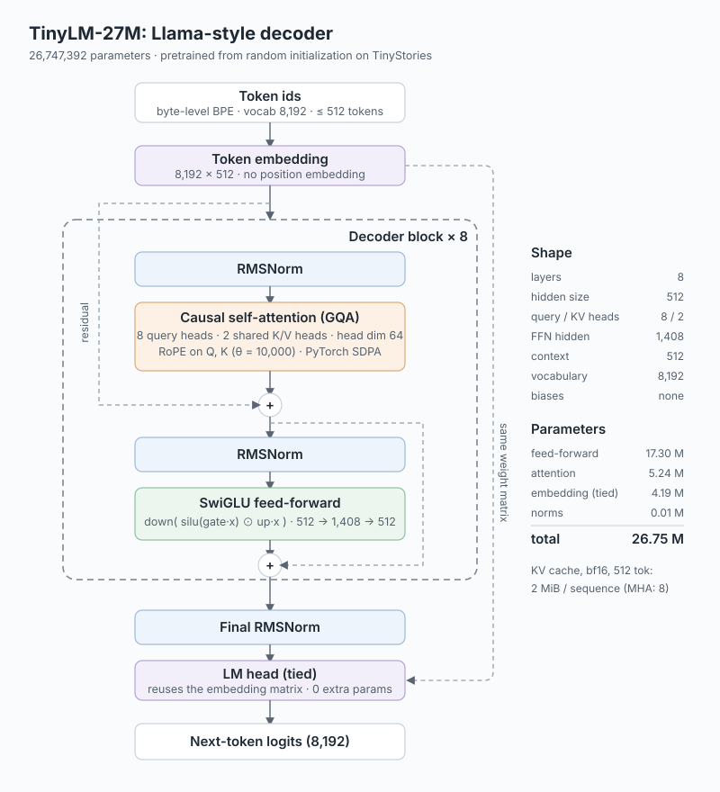
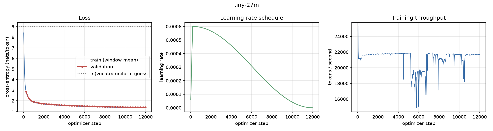
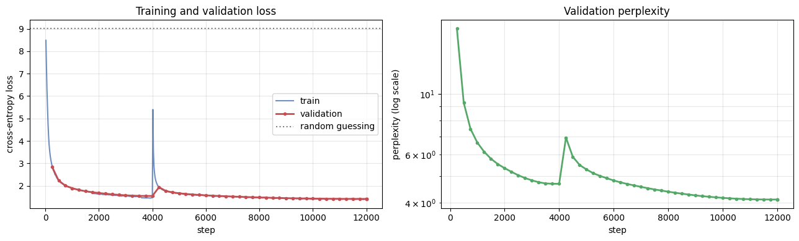
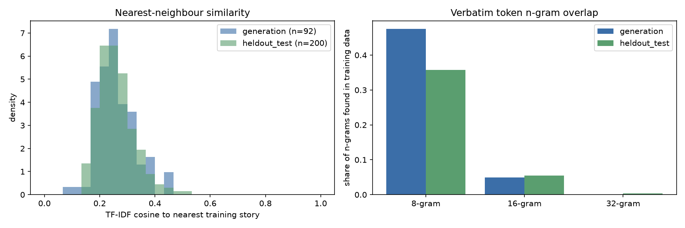
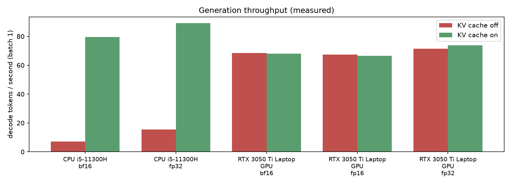

# TinyLM Lab

**Pretraining, evaluating, and understanding a ~27M-parameter Llama-style language model, trained from random initialization.**

`26.7M parameters` · `custom 8K byte-level BPE` · `512-token context` · `TinyStories` · `442M training tokens` · `test loss 1.384 (PPL 3.99) on a decontaminated test set`

[](https://github.com/sudhanshumukherjeexx/tiny-language-models/actions/workflows/tests.yml)
[](https://github.com/sudhanshumukherjeexx/tiny-language-models/actions/workflows/lint.yml)


[](LICENSE)
[](https://sudhanshumukherjeexx.github.io/tiny-language-models/)

**Project page with the findings and hand-drawn charts:** https://sudhanshumukherjeexx.github.io/tiny-language-models/

## Overview

The question this project asks: **how much useful language-modelling ability can a modern
Llama-style decoder with ~27M parameters learn when pretrained from random initialization on
TinyStories? And how do we tell real ability apart from memorization?**

The repository is a complete, tested pipeline: data preparation with exact token accounting, a
custom tokenizer, a transparent training loop that resumes exactly, a three-way
train/validation/test protocol, generation evaluation, memorization and leakage analysis,
hardware benchmarks, controlled architecture ablations, and a packaged model with a demo.

**What "from scratch" means here.** The tokenizer and every model weight are trained from random
initialization. The production model uses the Hugging Face `LlamaForCausalLM` architecture class
with PyTorch. A separate framework-free implementation of every component lives in
[`src/tinylm/educational/`](src/tinylm/educational/), and it reproduces the Hugging Face model's
logits exactly ([test](tests/test_model.py)).

> **Status.** The main experiment is complete: 12,000 steps (442M tokens) on one RTX 3050 Ti
> Laptop GPU, selected on validation, evaluated once on a decontaminated test split, with a
> generation suite and a memorization analysis, plus 15 parameter-matched architecture
> ablations (5 variants × 3 seeds). The original Colab notebook run is archived separately,
> with its caveats. Every number in this README comes from a recorded output file.

## Key results

| Metric | Value | Evidence |
|---|---:|---|
| Parameters | **26,747,392** | [`parameter_report`](src/tinylm/modeling.py), [test](tests/test_model.py) |
| Vocabulary / context | 8,192 / 512 | [`configs/tiny-27m.yaml`](configs/tiny-27m.yaml) |
| **Test loss / perplexity** | **1.3842 / 3.99** | 15,388 held-out stories (3,133,963 predicted tokens) with no exact copy in train; evaluated once ([test_metrics.json](results/runs/tiny-27m/evaluation/test_metrics.json)) |
| Validation loss (model selection) | 1.3895 / 4.01 | 10,474 stories hash-held-out from train; best at the final step |
| Training tokens | 442,368,000 (12,000 steps × 36,864; 0.95 epochs; 16.5 tokens/parameter) | [metrics.json](results/runs/tiny-27m/metrics.json) |
| Training run, **RTX 3050 Ti Laptop GPU** | 6.26 h wall clock, 21,142 tokens/s, 1,773 MB peak allocated (bf16, 8 × 9 micro-batches) | [metrics.json](results/runs/tiny-27m/metrics.json) |
| Memorization | Generations are no closer to their nearest training story than held-out human-written test stories are (median TF-IDF similarity 0.255 vs. 0.250); 2.2 % contain a verbatim 32-token span vs. 7.5 % of held-out stories | [memorization](#memorization-analysis) |
| Legacy notebook run (for reference) | validation loss 1.4148, on a split that was 29.9 % training data and also selected the checkpoint | [legacy run record](results/runs/legacy-colab-a100/) |
| Training throughput, **RTX 3050 Ti Laptop GPU** (bf16, micro-batch 16) | 21,734 tokens/s, 2,895 MB peak allocated | [benchmark record](results/benchmarks/) |
| Generation, **Core i5-11300H CPU** (fp32, batch 1, KV cache) | 89 tokens/s decode, 25 ms to first token | [benchmark record](results/benchmarks/) |
| Packed training data (current pipeline) | 464,403,968 tokens; 221 dropped (final remainder only) | [data pipeline](#data-pipeline) |

Throughput and memory are hardware-specific. Every number above names the device it was
measured on, and no T4 or A100 throughput has been measured.

## Example generation

Unedited greedy output of the trained model (prompt `open-05` of the fixed suite). Greedy decoding
is deterministic, so this command reproduces it:
`python scripts/generate.py --model runs/tiny-27m/best --prompt "Once upon a time, a small rabbit" --preset greedy`

> **Once upon a time, a small rabbit** named Benny lived in a big forest. Benny loved to eat
> carrots and play with his friends. One day, Benny saw a big, scary wolf. The wolf wanted to eat
> Benny for dinner. Benny was very scared and didn't know what to do.
>
> Benny's friend, a wise old owl, saw that Benny was scared and asked him what was wrong. Benny told
> the owl about the wolf. The owl said, "Don't worry, Benny. I will protect you. I will protect
> you." The owl flew up high and scared the wolf away.
>
> Benny was very happy and thanked the owl. Benny's friends came to his house and they all had a
> big feast together. Benny was no longer scared of the wolf and he was grateful to his friends for
> protecting him. *(end-of-story token after 161 tokens)*

It has a complete arc (problem, helper, resolution, ending), with small flaws: a repeated sentence,
and gratitude credited to "his friends" when the owl did the protecting. The other 91 suite outputs
are in [`generation_samples.jsonl`](results/runs/tiny-27m/evaluation/generation_samples.jsonl), and
the failures are catalogued in [`results/failure_analysis.md`](results/failure_analysis.md).

## Why this project exists

Running a transformer training notebook is easy. Knowing what the trained model can and cannot
do is harder. This project treats a small model as a subject of measurement: is the reported
number a validation or a test result? Did resuming change the experiment? Is a fluent story new,
or stitched from the training set? Which architectural choices matter at 27M parameters? What
does it cost on real hardware? Each of those questions has code, a test, or a recorded result
behind it.

## Architecture

<p align="center"></p>

| Component | Choice | Notes |
|---|---|---|
| Decoder | 8 pre-norm blocks, d = 512, no biases | `LlamaForCausalLM` |
| Attention | 8 query / 2 KV heads (GQA), head dim 64 | KV cache 4× smaller than MHA |
| Positions | RoPE, θ = 10,000 | no position parameters |
| Normalization | RMSNorm | |
| Feed-forward | SwiGLU, 512 → 1,408 → 512 | 64.7 % of parameters |
| Embeddings | tied input/output, 8,192 × 512 | 15.7 % of parameters |
| Attention kernel | PyTorch Scaled Dot Product Attention (SDPA) | may dispatch to a fused kernel such as FlashAttention when the hardware, dtype and mask are eligible |

**Parameter and memory accounting** (`tinylm.modeling`): feed-forward 17,301,504 · attention
5,242,880 · embedding 4,194,304 · norms 8,704. Weights take 102 MiB in fp32 and 51 MiB in bf16.
Static training state (fp32 weights + gradients + AdamW moments) is 408 MiB. KV cache at full
context in bf16 is 2 MiB per sequence (8 MiB with multi-head attention). GQA's saving matters
for high-concurrency serving, not for a single-user demo of a 27M model; see
[design decisions](docs/design-decisions.md).

## Data pipeline

TinyStories ([Eldan & Li, 2023](https://arxiv.org/abs/2305.07759)) ships only `train` and
`validation`. The pipeline assigns three roles:

| Split | Source | Role |
|---|---|---|
| train | official `train` minus the validation slice | gradient updates |
| validation | 0.5 % of official `train`, selected by hashing normalized text | checkpoint selection, ablation decisions |
| **test** | official `validation` **minus every story with an exact copy in train** | one final evaluation of the selected model |

Hash-based assignment is deterministic and places exact duplicates in the same split. The
official validation split is *not* clean: 6,582 of its 21,989 stories (29.9 %) have a
normalized-exact copy in the official train split. Those stories, plus 19 that duplicate a
validation story, are removed from test (`data.decontaminate_test`, see [leakage](#dataset-duplication-and-leakage-measured)). Stories
are normalized (NFKC, typographic punctuation → ASCII, Unicode otherwise **preserved**), filtered
to ≥ 100 characters, tokenized, separated by one EOS token, and packed into 512-token blocks. A
rolling remainder means only the final partial block of each split is dropped. The legacy
pipeline dropped one per 1,000-story batch.

Measured on the full dataset (revision `f54c09fd`, tokenizer `ce7e3da5`), from `data/tinystories/meta.json`:

| Split | Stories | Characters | Text tokens | Packed 512-token sequences | Dropped tokens | Retained |
|---|---:|---:|---:|---:|---:|---:|
| train | 2,109,002 | 1,890,735,237 | 462,295,187 | 907,039 | 221 | 99.99995 % |
| validation | 10,474 | 9,416,675 | 2,301,209 | 4,515 | 3 | 99.9999 % |
| test | 15,388 | 12,911,470 | 3,125,099 | 6,133 | 391 | 99.988 % |

243 training stories and 1 test story were under 100 characters and were removed, and 6,601
test stories were removed as exact copies of training stories. On the same
token stream, the legacy per-batch packing would have discarded 537,980 tokens (0.12 %). The
effect is small, but the accounting is now exact and validated on every run.

## Tokenizer

8,192-token byte-level BPE trained on the train split only (`scripts/train_tokenizer.py`).
Byte-level means there is no `<unk>`: any string, including emoji and CJK, round-trips exactly
(tested). One token, `<|endoftext|>`, serves as BOS and EOS; `<|pad|>` is never used in training
because sequences are packed.

| Measured on 2,000 validation stories | Value |
|---|---:|
| Characters per token | 4.09 |
| Tokens per story: mean / median / p95 | 220 / 187 / 434 |
| Exact decode round-trip | 100 % |
| Save → reload produces identical ids | yes |
| Training corpus | 2,109,002 stories, 1.89 B characters, 250 s (laptop CPU) |

The 95th-percentile story is 434 tokens, so the 512-token context holds about 95 % of stories end
to end. Full report, including Unicode probes: `data/tokenizer-8k/tokenizer_report.json`
(produced by `scripts/train_tokenizer.py`).

## Training methodology

A hand-written loop ([`tinylm/training.py`](src/tinylm/training.py)) instead of
`transformers.Trainer`, so that every technique is visible and resuming is exact:

* AdamW (β = 0.9/0.95, weight decay 0.1 on matrices only), 6e-4 peak LR, 200 warmup steps, cosine
  decay, gradient clipping at 1.0, 72 × 512 = 36,864 tokens per step.
* bf16 autocast on Ampere+, fp16 with loss scaling on older GPUs (T4), fp32 on CPU.
* Validation every 250 steps. The best-validation model is exported to `best/`. Test data is
  never read during training.
* **Exact resume.** Checkpoints hold model, optimizer, scheduler, grad scaler, RNG states and the
  data position, and the data order is a function of (seed, sequences consumed). A test checks
  that 5 steps + stop + resume for 7 steps gives the same weights as 12 uninterrupted steps
  (bitwise on CPU). On GPUs, non-deterministic kernels can introduce float-level differences.
* **Experiment vs. invocation metrics.** Steps, tokens, time, best validation loss and peak
  memory accumulate across resumes; each process invocation is recorded separately. Resuming
  with a changed configuration is refused. Both of these address problems in the legacy run (below).

Every run writes `config.yaml` (fully resolved), `environment.json`, `training_history.jsonl`,
`metrics.json` ([schema](results/experiment_schema.json)) and `training_curves.png`.

## Evaluation methodology

| Question | Method | Code |
|---|---|---|
| How well does it predict held-out text? | Token-weighted cross-entropy and perplexity on the untouched test split, evaluated once | `scripts/evaluate.py` |
| How does it generate? | Fixed, versioned [prompt suite](evaluation/prompts.json) (openings, character consistency, causality, long context, rare words, out-of-domain, prompt sensitivity) × decoding presets × fixed seeds, with full provenance | `tinylm.evaluation` |
| Is the output degenerate? | Distinct-1/2, repeated 4-gram fraction, sentence-repetition ratio, EOS rate, length. These are *diagnostics, not quality scores* | `tinylm.evaluation` |
| Is it good? | Rubric (grammar, coherence, consistency, creativity, completeness, repetition; 1–5) via an exported human-rating sheet or an optional LLM judge that saves prompts, raw responses and parsed scores | `tinylm.judge` |
| Is it copying? | Memorization analysis against the full training set, with held-out stories as a baseline | `scripts/check_memorization.py` |
| Is the data leaking? | Exact and near-duplicate analysis within and across splits | `scripts/check_data_integrity.py` |

Perplexity depends on the tokenizer and the dataset, so it is only compared between runs that
share both. There is no universal "good perplexity" threshold.

## Main results

### TinyLM-27M (`configs/tiny-27m.yaml`)

<p align="center"></p>

| Run | Hardware | Steps | Tokens | Best val loss (PPL) | **Test loss (PPL)** | Wall clock |
|---|---|---:|---:|---:|---:|---:|
| `tiny-27m-20261007-003023` | RTX 3050 Ti Laptop GPU, bf16 | 12,000 | 442.4M | 1.3895 (4.01) | **1.3842 (3.99)** | 6.26 h |

* **One uninterrupted, single-phase run.** Loss falls smoothly from 9.12 at initialization
  (ln 8192 = 9.01) to a final training loss of 1.355. There is no sign of overfitting at
  0.95 epochs.
* **Test was evaluated once**, after selection, on 15,388 stories (3.13M predicted tokens) with no
  exact copy in training. Test loss is slightly *lower* than validation loss. The two splits
  come from different sources (the official validation split vs. a hash-held-out slice of
  train), so a small offset in either direction is expected. It is not a sign of leakage: test
  shows the same leakage profile as validation ([leakage](#dataset-duplication-and-leakage-measured)).
* **Validation loss improved at all 48 evaluations**, so the selected checkpoint is also the final one.
* **Throughput dips** (sustained between steps ~5,200 and 6,800, briefly up to ~10,500) were not
  instrumented. Laptop thermal or power throttling, or other GPU load, is the likely cause. They
  cost speed, not correctness: the data order and results do not depend on timing.
* **Single seed.** At the reduced ablation budget, seed-to-seed standard deviation is
  0.002–0.018 nats, which bounds how much of a difference between runs is noise.

**Generation suite** (23 prompts; greedy once each, `balanced` = T 0.8 / top-p 0.9 with 3 seeds;
up to 200 new tokens; [lexical_metrics.json](results/runs/tiny-27m/evaluation/lexical_metrics.json)):

| Preset | Generations | Ended with end-of-story token | Mean words | Distinct-1 | Distinct-2 | Repeated 4-grams | Repeated sentences |
|---|---:|---:|---:|---:|---:|---:|---:|
| greedy | 23 | 57 % | 132 | 0.157 | 0.552 | 3.3 % | 0.2 % |
| balanced | 69 | 74 % | 124 | 0.106 | 0.496 | 1.6 % | 0.6 % |

Greedy decoding repeats more 4-grams than sampling (3.3 % vs. 1.6 %), the expected
likelihood-trap pattern. (Distinct-n is corpus-level, so it is lower for the larger sampled set
and is not directly comparable across presets of different sizes.) These are diagnostics, not
quality scores. The failure analysis below reads the outputs.

### Legacy notebook run (A100, 2026-08)

<p align="center"></p>

* Final development-validation loss **1.4148** (perplexity 4.12) on the official TinyStories
  validation split, after 12,000 steps (442M tokens, ~16.5 tokens per parameter).
* **About 30 % of that split's stories were also in the training data** (exact copies, measured
  after normalization). The number mixes held-out and memorizable text, so it is optimistic as
  an estimate of generalization.
* **That split also selected the checkpoint, and it is now the test split.** The number is a
  development result, and the legacy checkpoint cannot produce a clean test number.
* **The curve shows two phases.** At step ~4,000 the training loss jumps from ~1.5 to ~5.4 and
  validation loss rises. This is consistent with a 4,000-step subset run that was resumed as the
  12,000-step full run. It is a single experiment only in the bookkeeping sense.
* The notebook's printed "Training finished in 0.4 minutes, final training loss 0.0001" came from
  a resume of a finished run. The current trainer reports invocation and experiment metrics
  separately.

Full provenance and the list of caveats: [`results/runs/legacy-colab-a100/`](results/runs/legacy-colab-a100/).
The legacy validation number (1.4148) and the new test number (1.3842) are not directly
comparable: they use different tokenizers (the legacy one stripped non-ASCII text) and different
evaluation stories (the legacy split was 30 % training data).

## Ablation studies

*At matched parameter count, token budget, optimizer and data order, which parts of the modern
recipe matter at 27M parameters?* All variants use the **same** implementation
([`ReferenceDecoder`](src/tinylm/educational/model.py)), so the only difference between rows is
the component under study. Total parameters are matched within 0.03 % by adjusting the FFN width
only. Budget per run: 1,500 steps × 32 × 512 = 24.6M tokens; 3 seeds; scored on the full
validation split (never test).

| Variant | Position | Norm | FFN | KV heads | FFN width | Params | Val loss (mean ± std, 3 seeds) | Δ vs. previous row (per seed) | tok/s |
|---|---|---|---|---:|---:|---:|---:|---:|---:|
| Baseline (GPT-style) | learned | LayerNorm | GELU | 8 | 1,696 | 26,756,096 | 2.2208 ± 0.0019 | — | 26,197 |
| + RoPE | RoPE | LayerNorm | GELU | 8 | 1,728 | 26,756,096 | 2.0848 ± 0.0042 | **−0.136** (−0.139, −0.138, −0.131) | 22,284 |
| + RMSNorm | RoPE | RMSNorm | GELU | 8 | 1,728 | 26,747,392 | 2.0887 ± 0.0028 | +0.004 (+0.008, +0.001, +0.003) | 19,559 |
| + SwiGLU | RoPE | RMSNorm | SwiGLU | 8 | 1,152 | 26,747,392 | 2.0600 ± 0.0183 | −0.029 (−0.043, −0.006, −0.037) | 19,220 |
| + GQA (= production) | RoPE | RMSNorm | SwiGLU | 2 | 1,408 | 26,747,392 | **2.0268 ± 0.0143** | −0.033 (−0.029, −0.037, −0.034) | 19,057 |

All 15 runs: 1,500 steps, 24,576,000 tokens each, RTX 3050 Ti Laptop GPU, scored on the full
validation split ([`results/ablations/`](results/ablations/)). Seeds are paired: seed *k* uses the
same data order for every variant, so per-seed differences are meaningful.

What the ablations show, at this scale and budget:

* **RoPE is the single most important change.** Replacing learned absolute positions with RoPE
  lowers validation loss by 0.136 nats, about 50× the seed-to-seed spread, at equal parameters.
* **RMSNorm buys nothing in quality here.** It is +0.004 nats (slightly worse in all three
  seeds, but within ~1.4 standard errors). Its usual argument is speed and simplicity; in this
  repository's *un-fused* reference implementation it is actually slower than PyTorch's fused
  `LayerNorm`. That throughput column measures the reference code, not the production model.
* **SwiGLU helps modestly** (−0.029, all three seeds), with more seed variance than the other
  variants.
* **GQA helps at matched parameters** (−0.033, all three seeds). The comparison is
  *parameter-matched*, not attention-only: dropping from 8 to 2 KV heads frees 3.1M attention
  parameters, which the matched config spends on a wider FFN (1,152 → 1,408). At this scale that
  trade is a net win. GQA's KV-cache saving is a separate, inference-time benefit.
* **The full modern recipe beats the GPT-2-style baseline by 0.194 nats** (perplexity 9.22 → 7.59)
  at the same parameter count and token budget.

Caveats: 24.6M tokens is about 5.6 % of the main run's budget, so these are early-training
comparisons, and rankings can change with longer training. Three seeds detect the RoPE effect
unambiguously; the SwiGLU and GQA effects are consistent in sign across seeds but only about
2.5–2.7 standard errors from zero.

## Memorization analysis

A plausible story is not evidence of generalization. For each generated text,
`scripts/check_memorization.py` measures:

1. **Verbatim n-gram overlap with the entire training set.** Every 8/16/32-token n-gram of the
   generation is checked against all ~460M training tokens in one vectorized pass.
2. **Nearest training story** by TF-IDF cosine similarity (word uni+bigrams), streamed over all
   training stories.
3. **Longest common word span** with that nearest story.
4. **The same three measurements for held-out test stories.** TinyStories is formulaic enough
   that genuinely unseen text shares many n-grams with training data, so generations are judged
   against this baseline, not against zero.

Generations crossing documented thresholds (similarity ≥ 0.8, any verbatim 32-token span, or a
≥ 30-word shared span) are surfaced for manual review.

**Results for TinyLM-27M** (92 generations vs. 200 random held-out test stories, truncated to 200
tokens; [summary](results/runs/tiny-27m/evaluation/memorization/memorization_summary.json),
[all records](results/runs/tiny-27m/evaluation/memorization/memorization_records.jsonl)):

| Measure | Generations | Held-out test stories |
|---|---:|---:|
| TF-IDF similarity to nearest training story: median / p95 / max | 0.255 / 0.381 / 0.451 | 0.250 / 0.377 / 0.504 |
| Share of 8-token n-grams found verbatim in training data | 47.5 % | 35.8 % |
| Share of 16-token n-grams found verbatim | 4.9 % | 5.5 % |
| Texts containing any verbatim 32-token span | 2.2 % (2) | 7.5 % (15) |
| Longest shared word span with nearest story: median / max | 6 / 17 | 7 / 50 |
| Flagged for review | 2 | 15 |

<p align="center"></p>

What this supports:

* **No evidence of story-level memorization.** Generations are no closer to their nearest
  training story than real held-out stories are. No generation has more than 17 consecutive
  words in common with its nearest training story.
* **Phrase-level reuse is higher than in human-written text.** 47.5 % of generated 8-grams occur
  verbatim somewhere in training, against 35.8 % for held-out stories. At 16 and 32 tokens,
  generations overlap *less* than held-out text. The model recombines stock TinyStories phrases
  ("there was a little girl named Lily…") rather than reproducing stories.
* **The two flagged generations are one output.** Prompts `open-01` and `sens-02a` are both
  "Once upon a time" (seed 0). The shared 32-token span is the stock opening "there was a little
  girl named Lily. She loved to play…", and the nearest training story diverges right after it.

Limits of the evidence: 92 generations, a 200-story baseline, and memorization tested only
against prompts from this suite. Exact extraction attacks (prompting with real training
prefixes) were not attempted, so this is evidence against *spontaneous* copying, not proof that
no training story can be extracted.

### Dataset duplication and leakage (measured)

From [`results/data_integrity.json`](results/data_integrity.json) (current splits) and
[`results/data_integrity_official_splits.json`](results/data_integrity_official_splits.json) (raw official splits).
Exact duplicates use a hash of NFKC-normalized, case-folded, whitespace-collapsed text.
Containment is the share of a story's 13-token n-grams that occur anywhere in the 464M-token
training stream.

| Check | Raw official splits | Current protocol |
|---|---:|---:|
| Train: redundant exact copies (largest cluster = 3) | 318,673 (15.1 %) | unchanged; the training data is not deduplicated |
| Validation stories with an exact copy in train | — | 0 (by construction) |
| **Test stories with an exact copy in train** | **6,582 / 21,989 (29.9 %)** | **0 / 15,388** |
| Test stories ≥ 80 % contained in train (13-grams) | 29.9 % | 0 % |
| Mean 13-gram containment: validation / test | 0.080 / 0.356 | 0.080 / 0.081 |
| Near-duplicates (MinHash, Jaccard ≥ 0.8): test vs. 100K-story train sample | 308 | 0 |
| Near-duplicates within a 100K-story train sample | 1.44 % of stories | same |

What this shows:

1. **TinyStories' official validation split is about 30 % training data.** Any loss reported on
   it, including this repository's legacy 1.4148, partly measures recall of training stories.
2. **After removing exact copies, test is indistinguishable from the clean validation split** on
   every leakage measure: containment 0.081 vs. 0.080, and no near-duplicates. The residual
   overlap is the formulaic phrasing every TinyStories story shares.
3. The training data keeps its duplicates: 15 % of training stories appear two or three times.
   Deduplicating train would change the training distribution relative to the legacy run, so it
   is left as a deliberate, documented choice (and a candidate ablation).

## Performance benchmarks

Measured with `scripts/benchmark.py` on the hardware named in each row. Training uses random token
ids (cost does not depend on token values); generation is greedy with EOS disabled. Raw records,
including full environment info, are in [`results/benchmarks/`](results/benchmarks/). No row is
extrapolated to other hardware; in particular, **no T4 or A100 throughput has been measured.**
`configs/tiny-27m-t4.yaml` is a configured target, not a tested one.

**Training** (one optimizer step = forward + backward + clip + AdamW; 512-token sequences; 10 timed steps after 3 warm-up steps; production 27M model):

| Hardware | Precision | Micro-batch | tok/s | Step time (s) | Peak alloc (MB) |
|---|---|---:|---:|---:|---:|
| Core i5-11300H (CPU) | fp32 | 4 | 673 | 3.043 | — |
| RTX 3050 Ti Laptop (4 GB) | fp32 | 4 | 9,633 | 0.213 | 1,187 |
| RTX 3050 Ti Laptop (4 GB) | fp32 | 8 | 10,244 | 0.400 | 1,986 |
| RTX 3050 Ti Laptop (4 GB) | fp32 | 16 | 3,497 ⚠ | 2.342 | 3,643 |
| RTX 3050 Ti Laptop (4 GB) | fp32 | 24 | 660 ⚠ | 18.612 | 5,302 |
| RTX 3050 Ti Laptop (4 GB) | fp16 | 4 | 21,302 | 0.096 | 1,021 |
| RTX 3050 Ti Laptop (4 GB) | fp16 | 8 | 21,886 | 0.187 | 1,669 |
| RTX 3050 Ti Laptop (4 GB) | fp16 | 16 | 21,384 | 0.383 | 2,895 |
| RTX 3050 Ti Laptop (4 GB) | fp16 | 24 | 9,901 ⚠ | 1.241 | 4,183 |
| RTX 3050 Ti Laptop (4 GB) | bf16 | 4 | 18,702 | 0.110 | 1,021 |
| RTX 3050 Ti Laptop (4 GB) | bf16 | 8 | 20,828 | 0.197 | 1,669 |
| RTX 3050 Ti Laptop (4 GB) | bf16 | 16 | 21,734 | 0.377 | 2,895 |
| RTX 3050 Ti Laptop (4 GB) | bf16 | 24 | 10,507 ⚠ | 1.169 | 4,183 |

⚠ Peak allocation near or above the GPU's 4 GB. On Windows, the WDDM driver does not raise an
out-of-memory error; it spills into shared system memory, and throughput collapses (e.g. bf16 at
micro-batch 24 is half the speed of micro-batch 16). On this GPU the fastest setting is bf16 or
fp16 at micro-batch 8–16, about 21–22K tokens/s, which is ~2.1× fp32. At that rate the
442M-token run would take about 5.6 hours of pure step time (arithmetic, not a measured run).

**Generation** (batch 1, 32-token prompt, exactly 256 greedy tokens, median of 5 runs, random-init weights; speed does not depend on weight values):

| Hardware | Weights | KV cache | Time to first token (ms) | Decode tok/s | 256 tokens (s) |
|---|---|---|---:|---:|---:|
| Core i5-11300H (CPU) | fp32 | on | 24.8 | 89 | 2.89 |
| Core i5-11300H (CPU) | fp32 | off | 25.1 | 15 | 16.59 |
| Core i5-11300H (CPU) | bf16 | on | 54.1 | 80 | 3.26 |
| Core i5-11300H (CPU) | bf16 | off | 48.7 | 7 | 35.82 |
| RTX 3050 Ti Laptop (4 GB) | fp32 | on | 16.4 | 74 | 3.47 |
| RTX 3050 Ti Laptop (4 GB) | fp32 | off | 16.3 | 71 | 3.59 |
| RTX 3050 Ti Laptop (4 GB) | fp16 | on | 15.7 | 67 | 3.84 |
| RTX 3050 Ti Laptop (4 GB) | fp16 | off | 17.2 | 67 | 3.80 |
| RTX 3050 Ti Laptop (4 GB) | bf16 | on | 16.9 | 68 | 3.77 |
| RTX 3050 Ti Laptop (4 GB) | bf16 | off | 16.8 | 68 | 3.75 |

Two observations:

* **On this GPU, at batch 1, the KV cache makes no measurable difference** (~70 tok/s either way).
  A 27M-parameter forward pass is far too small to keep the GPU busy, so per-token kernel launches
  and Python overhead dominate.
* **On the CPU, the KV cache is a 6× speedup** (89 vs 15 tok/s), because recomputing attention
  over the whole prefix is real work there. For single-user serving of this model, a laptop CPU
  decodes faster than this laptop GPU. That is a property of tiny models, not a general claim.

<p align="center"></p>

## Failure analysis

[`results/failure_analysis.md`](results/failure_analysis.md) catalogues real failures of the new
model on the fixed prompt suite, and of the legacy checkpoint, each with the prompt, the output,
the likely cause and a possible mitigation. Highlights from TinyLM-27M:

| Failure | Example (unedited) |
|---|---|
| Contradicts its own prompt | Prompt: "Leo… **really loved trains**." → "But **I don't like trains**. They are too loud and too fast," Leo said. |
| Ignores an instruction one sentence later | Mom: "You can't play on the swing." → "She listened to her mom. **She played on the swing** and had fun." |
| Degenerate repetition | "No, Max, that's not a fish. That's a fish. It's a fish. It's not a fish. It's a fish." |
| Physically impossible repair | A dropped glass "broke"… "soon **the glass was fixed**." |
| Long-context collapse | After a ~200-token setup about a lost turtle and a seagull, it writes 33 tokens and ends the story; the turtle picks up a shell and shows it to grandpa. |
| Rare words fall apart into subwords | "archaeologist" → "The **archae arched** around the room… The **archaeist** was so happy" |
| No world knowledge | "What is the capital of France? Answer:" → "Neverse! Neverse France is a special kind of capture." |
| Robust where it should be | "Once upon a time" vs. "Once upon a time," produce the same greedy story |

## Reproduction

```bash
git clone https://github.com/sudhanshumukherjeexx/tiny-language-models
cd tiny-language-models
uv sync --extra cu130          # CUDA 13 wheels; or --extra cu126 (older drivers) or --extra cpu

uv run python scripts/train_tokenizer.py --config configs/tiny-27m.yaml
uv run python scripts/prepare_data.py    --config configs/tiny-27m.yaml
uv run python scripts/check_data_integrity.py --config configs/tiny-27m.yaml
uv run python scripts/train.py           --config configs/tiny-27m.yaml   # resumes automatically
uv run python scripts/evaluate.py        --config configs/tiny-27m.yaml --record-index results/experiments.csv
uv run python scripts/check_memorization.py --config configs/tiny-27m.yaml \
    --generations runs/tiny-27m/evaluation/generation_samples.jsonl
uv run python scripts/benchmark.py       --config configs/tiny-27m.yaml
uv run python scripts/run_ablation.py    --seeds 0 1 2
```

* **Why the torch build is an extra.** PyTorch publishes CUDA builds on separate package indexes,
  and the right one depends on your driver: CUDA 12.8 wheels stop at torch 2.11, so the lock
  offers `cu126` and `cu130`. `uv.lock` pins exact versions of everything else for all
  three variants.
* **Quick check first:** `configs/smoke.yaml` runs the whole pipeline (2,000 stories, tiny model)
  in a few minutes on a laptop. Its outputs are pipeline checks, not results.
* **Out of memory?** Halve `per_device_train_batch_size` and double
  `gradient_accumulation_steps` with `--set`. The optimizer batch is unchanged and the run can
  resume with the new values.
* **Time-limited sessions (Colab):** `scripts/train.py --stop-after-steps 2000` trains, saves a
  checkpoint and exits; re-run to continue.
* **Notebook:** [`notebooks/01_pretraining_walkthrough.ipynb`](notebooks/01_pretraining_walkthrough.ipynb)
  walks through the same pipeline cell by cell (Colab-ready, `MODE = "smoke" | "quick" | "full"`).
* Development: `uv run pytest` (CPU-only, ~10 s) · `uvx ruff check . && uvx ruff format --check .`

## Repository structure

```text
configs/            tiny-27m.yaml (main), -t4 / -a100 variants, smoke.yaml, ablations/, legacy/
src/tinylm/
  config.py         typed YAML config with `extends:` and --set overrides
  data.py           normalization, hash splits, rolling-remainder packing, token accounting
  tokenizer.py      byte-level BPE training, fingerprinting, diagnostics
  modeling.py       model construction, parameter / memory / KV-cache accounting
  training.py       training loop, exact resume, model selection
  checkpointing.py  checkpoints (model, optimizer, scheduler, scaler, RNG), export
  evaluation.py     held-out loss, generation suite, lexical metrics
  generation.py     decoding presets and the TinyLM API
  memorization.py   corpus-wide n-gram scan, TF-IDF retrieval, overlap report
  integrity.py      exact / near-duplicate and cross-split leakage analysis
  benchmarking.py   training and generation benchmarks
  judge.py          optional LLM judge and manual rating sheets
  educational/      RMSNorm, RoPE, GQA attention, SwiGLU, decoder block, ReferenceDecoder
scripts/            CLIs: train_tokenizer, prepare_data, train, evaluate, generate,
                    check_memorization, check_data_integrity, benchmark, run_ablation, plot_training
tests/              CPU test suite (tiny fixtures; no downloads)
evaluation/         versioned prompt suite
results/            run records, benchmarks, data integrity, failure analysis, experiment index
notebooks/          educational walkthrough
app/                Gradio demo (Hugging Face Spaces-ready)
site/               project website (GitHub Pages); charts generated from results/ by site/build_data.py
docs/               design decisions, release process
```

## Model usage

```python
from tinylm import TinyLM

lm = TinyLM.from_pretrained("runs/tiny-27m/best")  # or a Hugging Face Hub id once published
print(lm.generate("Once upon a time", max_new_tokens=100, temperature=0.8, top_p=0.9, seed=42))
print(lm.generate("Once upon a time", preset="greedy"))
```

Presets (`greedy`, `low_temperature`, `balanced`, `creative`, `top_k`, `top_p`) pass only the
parameters their mode uses. Sampling presets set `top_k` explicitly because transformers otherwise
applies top-k 50 silently. The exported directory is a standard Hugging Face model and loads
with `AutoModelForCausalLM.from_pretrained`. The tied `lm_head.weight` is stored once, as part of
the embedding, and the tie is verified after reload. Publishing steps: [`model_card.md`](model_card.md).

## Demo

```bash
uv sync --extra cu130 --extra app
TINYLM_MODEL=runs/tiny-27m/best uv run python app/app.py
```

Prompt, max new tokens, temperature, top-p, top-k and seed, plus model metadata.
[`app/`](app/) is a ready-to-deploy Hugging Face Space (no public demo is live yet).

## Limitations

* **Narrow, synthetic data.** TinyStories is simple, GPT-generated English. Nothing here measures
  world knowledge, reasoning beyond story-level causality, or general language ability.
* **Small model, short context.** 27M parameters and 512 tokens: state tracking and causal
  consistency fail often (see the failure analysis).
* **English only.** The tokenizer and data are English. Unicode is preserved but barely trained.
* **Not an assistant.** No instruction tuning or safety alignment. Out-of-domain prompts get
  story-like or nonsensical output.
* **Memorization is measured, not ruled out.** Generations show no story-level copying relative
  to held-out text, but extraction with real training prefixes was not tested.
* **Single seed at full scale.** The full run has one seed. At the reduced ablation budget, the
  seed-to-seed standard deviation of validation loss is 0.002–0.018 nats.
* **One full training run, on a laptop GPU.** Results are for one configuration; nothing here
  shows how they scale.
* **The training data keeps its duplicates.** 15 % of training stories appear two or three times.
* **Automated judging is noisy.** Lexical metrics are not quality scores. LLM judges have their own
  biases and are not deterministic.

## Future work

* Longer-budget ablations to check whether the SwiGLU/GQA ranking holds past early training.
* Train-set deduplication as an ablation (15 % of training stories are exact repeats).
* Prefix-extraction memorization tests (prompt with the first 32 tokens of real training stories).
* Tokenizer comparisons (4K/8K/16K vocabularies at a fixed parameter budget).
* Small scaling study (e.g. 7M → 27M → 90M parameters at matched tokens/parameter) before
  drawing any scaling conclusions.
* Post-training quantization (int8/int4) with quality and latency measured on the same suite.
* Longer context with RoPE scaling, measured on the long-context prompts.
* Instruction tuning on a small, well-specified task, keeping the base-model evaluation as a
  regression suite.

## References

* Vaswani et al. (2017). *Attention Is All You Need.* [arXiv:1706.03762](https://arxiv.org/abs/1706.03762)
* Eldan & Li (2023). *TinyStories: How Small Can Language Models Be and Still Speak Coherent English?* [arXiv:2305.07759](https://arxiv.org/abs/2305.07759)
* Su et al. (2021). *RoFormer: Enhanced Transformer with Rotary Position Embedding.* [arXiv:2104.09864](https://arxiv.org/abs/2104.09864)
* Zhang & Sennrich (2019). *Root Mean Square Layer Normalization.* [arXiv:1910.07467](https://arxiv.org/abs/1910.07467)
* Shazeer (2020). *GLU Variants Improve Transformer.* [arXiv:2002.05202](https://arxiv.org/abs/2002.05202)
* Ainslie et al. (2023). *GQA: Training Generalized Multi-Query Transformer Models from Multi-Head Checkpoints.* [arXiv:2305.13245](https://arxiv.org/abs/2305.13245)
* Dao et al. (2022). *FlashAttention: Fast and Memory-Efficient Exact Attention with IO-Awareness.* [arXiv:2205.14135](https://arxiv.org/abs/2205.14135)
* Touvron et al. (2023). *LLaMA: Open and Efficient Foundation Language Models.* [arXiv:2302.13971](https://arxiv.org/abs/2302.13971)
* Hoffmann et al. (2022). *Training Compute-Optimal Large Language Models.* [arXiv:2203.15556](https://arxiv.org/abs/2203.15556)
* Brown et al. (2020). *Language Models are Few-Shot Learners* (13-gram contamination analysis). [arXiv:2005.14165](https://arxiv.org/abs/2005.14165)
* Li et al. (2016). *A Diversity-Promoting Objective Function for Neural Conversation Models* (Distinct-n). [arXiv:1510.03055](https://arxiv.org/abs/1510.03055)
* Broder (1997). *On the Resemblance and Containment of Documents* (MinHash).
* Wolf et al. (2020). *Transformers: State-of-the-Art Natural Language Processing.* [ACL Demos](https://aclanthology.org/2020.emnlp-demos.6/)

## Licensing

Code: [MIT](LICENSE). Data: TinyStories is distributed by its authors under its own license on the
Hugging Face Hub; this repository does not redistribute it and claims no ownership. Model weights
trained on it (when published) carry the license stated in the model card, subject to the
dataset's terms.
